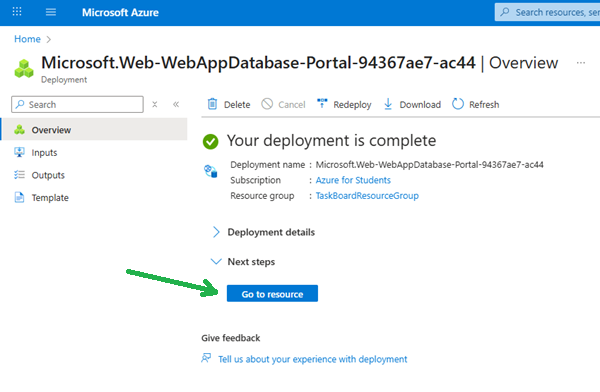
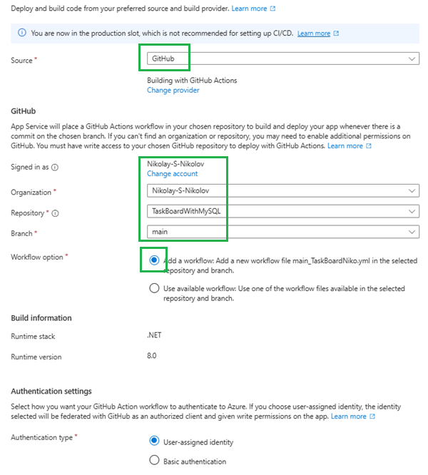

# TaskBoardWithMySQL

# Deploy TaskBoard (.NET 8 + MySQL) to Azure App Service

This guide describes how to deploy the TaskBoard ASP.NET Core (.NET 8) application with a MySQL database to Azure App Service using the Azure Portal and GitHub integration.

---

## Step 1: Upload Project to GitHub

1. Push your TaskBoard project code to a new GitHub repository.
2. Make sure your repository contains all necessary files, including the `.csproj` and `appsettings.json`.

---

## Step 2: Create Azure Resources

1. Log in to the [Azure Portal](https://portal.azure.com).
2. In the search bar, type **Web App + Database** and select it from the Marketplace.

3. On the "Create Web App + Database" page:
   - **Subscription:** Leave as default.
   - **Resource Group:** Create a new one, e.g., `TaskBoardResourceGroup`.
   - **Region:** Choose a region near you (e.g., West US 3).
   - **Web App Name:** Set a unique name, e.g., `TaskBoardYourName`.
   - **Runtime Stack:** Select **.NET 8 (LTS)**.

   - **Database Engine:** Choose **MySQL** (not SQL Azure).
   - **Server and Database Names:** Set as desired.
   - **Hosting Plan:** Choose "Basic" or as needed.

4. Click **Review + Create**, then **Create**.
5. Wait for deployment to finish and click **Go to resource**.

---

## Step 3: Set Up Database Connectivity

1. In your App Service, go to **Settings** > **Environment variables**>**Connection strings**.
2. Find the generated MySQL connection string.

3. **Rename** the connection string to match your app's configuration in TaskBoard.WebApp\appsettings.json, e.g., `DefaultConnection`.

4. **Apply** the configuration.

---

## Step 4: Deploy Code from GitHub

1. In your App Service, go to **Deployment**.
2. From **Deployment Center**>**Settings**, choose **Source**>**GitHub** and sign in.

3. Select your organization, repository, and branch.

4. Click **Save**.

5. Azure will set up a GitHub Actions workflow to build and deploy your app automatically.

---

## Step 5: Browse the App

1. After deployment, go to **Overview** in your App Service.
2. Click the URL to open your app:  
   `https://<app-name>.azurewebsites.net`

3. Your TaskBoard app should now be live and connected to the Azure MySQL database.

---

